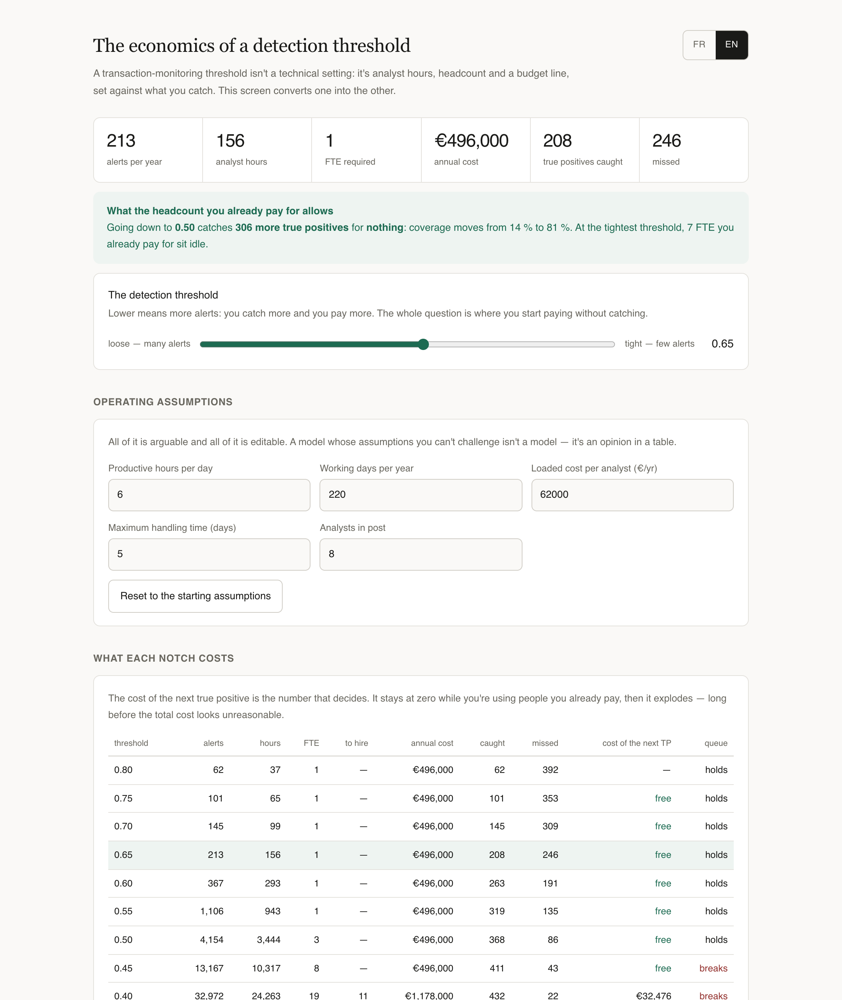

# What a detection threshold actually costs

A transaction-monitoring threshold gets set in a meeting, by intuition. It is in fact a
staffing decision and a budget line, and almost nobody prices it before moving it.

This turns the setting into the three things a finance committee understands — hours,
people, money — against what it catches.

```
npm start      # the screen, on localhost:4700
npm run modele # the table below
npm test
```



---

## The finding

Eight analysts in post. A tight threshold of 0.80, which is where a cautious team lands.

| Threshold | Alerts/yr | Hours | FTE | To hire | Annual cost | Caught | Missed | Cost of the next TP | Queue |
|---|---|---|---|---|---|---|---|---|---|
| 0.80 | 62 | 37 | 1 | — | €496,000 | 62 | 392 | — | holds |
| 0.70 | 145 | 99 | 1 | — | €496,000 | 145 | 309 | **free** | holds |
| 0.60 | 367 | 293 | 1 | — | €496,000 | 263 | 191 | **free** | holds |
| **0.50** | 4,154 | 3,444 | 3 | — | €496,000 | **368** | 86 | **free** | holds |
| 0.45 | 13,167 | 10,317 | 8 | — | €496,000 | 411 | 43 | free | **breaks** |
| 0.40 | 32,972 | 24,263 | 19 | 11 | €1,178,000 | 432 | 22 | €32,476 | breaks |
| 0.35 | 68,724 | 47,342 | 36 | 28 | €2,232,000 | 445 | 9 | €81,077 | breaks |

**At 0.80 the team uses one FTE out of eight.** Seven analysts are paid to be idle, and
392 of 454 true positives go undetected.

Moving to 0.50 catches **306 more true positives for nothing** — coverage goes from 14 %
to 81 % — because the payroll is already committed. Below that, the cost of the next true
positive goes €32,476, then €81,077.

The organisation was never short of money. It was short of the calculation.

---

## Three things a cost-per-alert model gets wrong

**Cost grows faster than volume.** Handling time isn't flat: a clear-cut alert is filed in
minutes, an ambiguous one takes an hour and a second opinion. Lowering the threshold adds
*ambiguous* alerts specifically. Between 0.70 and 0.50 the volume goes ×29 and the hours
go ×35. A model averaging cost per alert understates the change, and it understates it in
the dangerous direction.

**Headcount is a step, not a slope.** You hire whole people. Inside a step, tightening
detection is genuinely free; crossing one costs a full salary. Both facts disappear in a
per-alert average, and they are the only two that matter when deciding.

**The queue is a cliff, not a slope.** At 0.45 the model needs 8 FTE against 8 in post —
and breaks. A queue cannot run at full occupancy: the backlog stops clearing, the delay
runs away, and the regulatory deadline goes with it. That happens *before* a single new
hire appears in the budget, which is why it surprises people. A 10 % volume increase can
move a team from fine to broken while the cost line barely moves.

---

## How to read it critically

Every operating assumption is editable on screen — productive hours per day, working days
per year, loaded cost, headcount. A model whose assumptions you can't challenge isn't a
model, it's an opinion in a table.

The defaults are deliberately conservative: **6 productive hours a day**, not 8. Anyone
modelling an analyst at 8 hours of case review is modelling a person who doesn't exist,
and every conclusion downstream inherits that.

The alert population is **synthetic and seeded**, so two scenarios are comparable. True
and false positives overlap heavily by construction — if they separated cleanly the job
wouldn't exist, and neither would the decision this tool exists to inform.

The queue verdict uses the standard result that waiting time grows as 1/(1−load). It isn't
meant to be precise. It's meant to show that the curve turns vertical well before 100 %
occupancy, which is the part people get wrong.

---

## How it's built

```
src/
  alertes.ts   the synthetic alert population and the handling-time curve
  modele.ts    hours, FTE, cost, marginal cost per true positive, queue verdict
  serveur.ts + ui.html   one screen, French or English
```

Node 26 with native TypeScript, `node:test`, no build step, no dependencies. 12 tests,
including one that fails if the free zone disappears — because that's the finding, and a
refactor that quietly removes it should not pass silently.

---

## What it doesn't do

- **No real data.** The numbers are plausible, not observed. On a real book of business,
  the handling-time curve and the score distribution have to be measured — the shape of
  the conclusion holds, the values don't.
- **No cost of a miss.** It prices what detection costs, not what a missed report costs.
  That figure exists (fines, remediation, licence risk) and it belongs in the same table;
  it's the obvious next step and it needs numbers I'm not going to invent.
- **No ramp time.** A new analyst is productive on day one here. In reality they cost
  three to six months of someone else's time first.

---

Part of a set of four: [document search that refuses when it doesn't
know](https://github.com/ArslaneSempai-ui/compliance-document-search), [an onboarding
agent that escalates when it isn't
confident](https://github.com/ArslaneSempai-ui/kyc-triage-agent), [a bench that says
whether either still works](https://github.com/ArslaneSempai-ui/regression-bench), and
this — what the setting costs.

**Arslane Chaouche Ramdane** — six years in AML/KYC and financial crime operations:
30,000+ profiles reviewed, 6,000+ escalations, a team of five, and an 18 % cut in
false-positive escalations. This is the calculation I wish someone had shown me.
