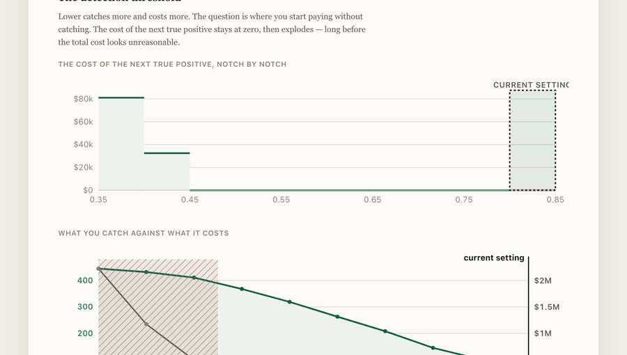

# What a detection threshold actually costs

A transaction-monitoring threshold gets set in a meeting, by intuition. It is in fact a
staffing decision and a budget line, and almost nobody prices it before moving it.

<!-- figures:finding -->
**The finding.** At the tight threshold a cautious team lands on, 7 of 8 analysts are paid to sit idle while 392 of 454 reportable cases go undetected. Loosening to 0.50 catches **306 more for no extra money** — the payroll is already committed. The organisation was never short of budget. It was short of the calculation.
<!-- /figures:finding -->

**[Try it in your browser →](https://arslanesempai-ui.github.io/alert-triage-economics/)** — every assumption is editable and the model recomputes live. Put your own headcount in.



```bash
npm start        # the screen, on localhost:4700
npm run model    # the cost curve, threshold by threshold
npm run shadow   # what the next analyst actually buys
npm run plan     # the quarter the hiring decision is due
npm test         # types, README figures, and 27 tests
```

Everything runs locally. No API key, nothing leaves the machine, and anyone who clones this
reproduces every number below.

---

## The cost curve

Eight analysts in post. A tight threshold of 0.80, which is where a cautious team lands.

<!-- figures:curve -->
| Threshold | Alerts/yr | Hours | FTE | To hire | Annual cost | Caught | Missed | Cost of next TP | Occupancy | Wait | Queue |
|---|---|---|---|---|---|---|---|---|---|---|---|
| 0.80 | 62 | 37 | 1 | — | $496,000 | 62 | 392 | — | 0 % | 0.0 d | **holds** |
| 0.70 | 145 | 99 | 1 | — | $496,000 | 145 | 309 | free | 1 % | 0.0 d | **holds** |
| 0.60 | 367 | 293 | 1 | — | $496,000 | 263 | 191 | free | 3 % | 0.0 d | **holds** |
| **0.50** | **4,154** | **3,444** | **3** | — | **$496,000** | **368** | 86 | free | 33 % | 0.1 d | **holds** |
| 0.45 | 13,167 | 10,317 | 8 | — | $496,000 | 411 | 43 | free | 98 % | 5.5 d | **late** |
| 0.40 | 32,972 | 24,263 | 19 | 11 | $1,178,000 | 432 | 22 | $32,476 | 230 % | — | **breaks** |
| 0.35 | 68,724 | 47,342 | 36 | 28 | $2,232,000 | 445 | 9 | $81,077 | 448 % | — | **breaks** |
<!-- /figures:curve -->

<!-- figures:headline -->
**At 0.80 the team uses 1 FTE out of 8.** 7 analysts are paid to be idle, and 392 of 454 true positives go undetected.

Moving to 0.50 catches **306 more true positives for nothing** — coverage goes from 14 % to 81 % — because the payroll is already committed.
<!-- /figures:headline -->

The organisation was never short of money. It was short of the calculation.

---

## What the next analyst actually buys

A committee asked to fund a head gets a cost and a feeling. The question it is really
asking has an answer: at the threshold the team can then sustain, how many more reportable
cases get found, and what does each one cost?

Measured as a **step, not a slope**. The recommendation is one of ten discrete thresholds,
so differentiating gives the honest and useless answer "the next dollar buys nothing"
almost everywhere. What decides is how wide the next step is.

<!-- figures:staircase -->
| Analysts added | Step width | Threshold | Cases found | Coverage | Payroll | This step cost |
|---|---|---|---|---|---|---|
| — (today) | — | 0.50 | 368 | 81 % | $496,000 | — |
| 1 | +1 | 0.45 | 411 | 91 % | $558,000 | +43 cases · **$1,442** each |
| 11 | +10 | 0.40 | 432 | 95 % | $1,178,000 | +21 cases · **$29,524** each |
| 29 | +18 | 0.35 | 445 | 98 % | $2,294,000 | +13 cases · **$85,846** each |

The widest run of headcount that buys **nothing at all** is 17 analysts wide.
<!-- /figures:staircase -->

The first analyst is a bargain. The second through the tenth buy **nothing** — not less,
nothing — because a threshold the queue cannot sustain is not a threshold anybody runs.
The eleventh completes a step that costs twenty times as much per case as the first.

A committee funding "a couple more heads" out of the eleven is buying the flat part.

### The same step, priced three ways

<!-- figures:routes -->
Getting from the threshold in use down to 0.45 finds **43 more reportable cases a year**. There are three ways to get there:

| Route | Cost |
|---|---|
| 1 more day of handling time | **free** |
| 1 more analyst | $62,000 a year |
| 15 more productive minutes a day | not priced here |

"Free" is a budget line, not a risk position. At 0.45 the queue settles at 5.5 working days — **9.2 calendar days**, which is the unit `31 CFR 1020.320(b)(3)` counts in — against a 30-day wall. That leaves 20.8 days of margin, and margin is what absorbs a holiday period or a resignation. The route costs no money and spends something.
<!-- /figures:routes -->

Same step, same cases. The paper that reaches a committee is almost always the one with a
price on it, and it is not the cheapest.

---

## The quarter the decision is due

Everything above answers a question about today. Nobody runs a compliance operation at a
fixed volume: transactions grow, alerts grow with them, and a queue comfortable at 33 %
occupancy is not comfortable eight quarters later.

The finding isn't that the queue eventually breaks — everyone knows that. It's **when you
had to decide**. A req takes sixteen weeks and a new analyst is worth half a head in their
first quarter, so the decision lands two quarters before the arrival and the arrival lands
before the break. Work that backwards and the decision is due while every indicator on the
dashboard is still green.

<!-- figures:horizon -->
Holding the threshold this tool recommends (0.50), at 6 % volume growth a quarter, 15 % annual attrition, and a 16-week hiring lead time:

|  | Operations | Alerts | Heads needed | Heads held | Occupancy | Wait | Verdict |
|---|---|---|---|---|---|---|---|
| Q1 | 400,000 | 4,154 | 3 | 8.0 | 33 % | 0.1 d | holds |
| Q2 | 424,000 | 4,412 | 3 | 7.7 | 35 % | 0.1 d | holds |
| Q3 | 449,440 | 4,684 | 4 | 7.4 | 42 % | 0.1 d | holds |
| Q4 | 476,406 | 4,966 | 4 | 7.1 | 45 % | 0.1 d | holds |
| Q5 | 504,991 | 5,264 | 4 | 6.9 | 47 % | 0.1 d | holds |
| Q6 | 535,290 | 5,554 | 4 | 6.6 | 50 % | 0.1 d | holds |
| Q7 | 567,408 | 5,853 | 4 | 6.4 | 61 % | 0.2 d | holds |
| Q8 | 601,452 | 6,210 | 5 | 6.1 | 65 % | 0.3 d | holds |

**The step this tool calls free.** Going from 0.50 to 0.45 costs no money this quarter — 1 more day of handling time. It holds on the 8 analysts in post until **Q2**, when it needs 1 more — 4 more by Q8. A 16-week req puts that decision at **1 quarter ago**.

Nobody can hand you next year's growth rate, so here is the range instead:

| Growth per quarter | Queue fails | First decision due |
|---|---|---|
| 2 % | not on this horizon | nothing to decide |
| 4 % | not on this horizon | nothing to decide |
| 6 % | not on this horizon | nothing to decide |
| 8 % | not on this horizon | nothing to decide |
| 10 % | not on this horizon | nothing to decide |
| 15 % | Q7 | Q5 |
<!-- /figures:horizon -->

That is the gap an operations review cannot close. A review reports the present, and the
present is not when the decision was.

---

## What is actually being bought

The cost on one side of this model buys compliance with a specific obligation, and it is
worth naming rather than leaving as an abstraction.

<!-- figures:citations -->
| Citation | Requires | Figure | Retrieved |
|---|---|---|---|
| [31 CFR 1020.320(a)(2)](https://www.law.cornell.edu/cfr/text/31/1020.320) | A bank must report a suspicious transaction conducted or attempted by, at or through it once the amount involved or aggregated reaches the threshold. | $5,000 | 2026-08-17 |
| [31 CFR 1020.320(b)(3)](https://www.law.cornell.edu/cfr/text/31/1020.320) | The report is due within thirty calendar days of initial detection. Where no suspect has been identified the bank may take a further thirty days, and never more than sixty in total. | 30 days, 60 maximum | 2026-08-17 |
| [31 CFR 1020.320(d)](https://www.law.cornell.edu/cfr/text/31/1020.320) | The bank keeps a copy of the report and its supporting documentation for five years from the filing date. | 5 years | 2026-08-17 |
| [31 CFR 1020.320(e)](https://www.law.cornell.edu/cfr/text/31/1020.320) | Nobody at the bank may disclose a report, or any information that would reveal one exists. | — | 2026-08-17 |
| [31 CFR 1010.311](https://www.law.cornell.edu/cfr/text/31/1010.311) | A currency transaction above the threshold is reported by the financial institution. | $10,000 | 2026-08-17 |
<!-- /figures:citations -->

The handling-time setting matters more than it looks. A suspicious transaction must be
reported within 30 calendar days of **initial detection** — the clock starts when the
facts became known, not when the review concludes. An alert queue taking twenty working
days to reach an analyst has spent the regulatory deadline before anyone has opened the
file. The deadline is the wall; the internal target is the plan, and they are not the same
number.

Every citation was retrieved from the source on the date shown. Nothing here is cited from
memory.

---

## Three things a cost-per-alert model gets wrong

**Cost grows faster than volume.** Handling time isn't flat: a clear-cut alert is filed in
minutes, an ambiguous one takes an hour and a second opinion. Lowering the threshold adds
*ambiguous* alerts specifically. Between 0.70 and 0.50 the volume goes ×29 and the hours
go ×35. A model averaging cost per alert understates the change, and it understates it in
the dangerous direction.

**Headcount is a step, not a slope.** You hire whole people. Inside a step, tightening
detection is genuinely free; crossing one costs a full salary. Both facts disappear in a
per-alert average, and they are the only two that matter when deciding.

**The queue is a cliff, not a slope.** Clearing the backlog and meeting the deadline are
two different things, and the second gives way first. At 0.45 the team sits at 98 %
occupancy: the backlog does still clear, but the average wait reaches 5.5 days against a
promised 5. Push a little further and the queue diverges outright. Both of those happen
*before* a single new hire appears in the budget, which is why they surprise people — a
10 % volume increase can move a team from fine to late while the cost line barely moves.

An earlier version of this model declared the queue broken at 95 % occupancy, a number I
had picked myself. It was doing real damage: it pre-empted the deadline check, so the
promised handling time could never be the binding constraint and the setting exposing it
was decorative. The promise made to the regulator decides now.

---

## How to read it critically

Every operating assumption is editable on screen — productive hours per day, working days
per year, loaded cost, headcount. A model whose assumptions you can't challenge isn't a
model, it's an opinion in a table.

The defaults are deliberately conservative: **6 productive hours a day**, not 8. Anyone
modelling an analyst at 8 hours of case review is modelling a person who doesn't exist,
and every conclusion downstream inherits that.

The alert population is **synthetic and seeded**, so two scenarios are comparable. True
and false positives overlap heavily by construction — if they separated cleanly the job
wouldn't exist, and neither would the decision this tool exists to inform.

The queue verdict uses the standard result that waiting time grows as 1/(1−load). It isn't
meant to be precise, and it reports a **mean**: at 98 % occupancy the average wait is 5.5
days, which also means half the files wait longer. One absence, one holiday period, and a
team sitting there is already past its deadline. Treat anything above about 90 % as
fragile rather than as fine.

---

## Where every number comes from

A table renders a figure retrieved from the Code of Federal Regulations and a figure I
picked in exactly the same typeface, which quietly claims they are equivalent. They are
not, and the ranking isn't subtle.

<!-- figures:provenance -->
**5 retrieved**, **5 measured**, **9 assumed**, **4 chosen**. What each kind means, and what you are entitled to ask of it:

- **retrieved** — a public source says this, on the date recorded, in words linked from the page. *follow the link.*
- **measured** — running the code in this repository produces it. *run it yourself — the draws are seeded.*
- **assumed** — an input nobody here can know; yours to supply. *put your own figure in, and read the band around it.*
- **chosen** — my judgement and nothing else. *check whether the sweep says it decides anything.*

| Kind | Name | What it is | Note |
|---|---|---|---|
| retrieved | `31 CFR 1020.320(a)(2)` | A bank must report a suspicious transaction conducted or attempted by, at or through it once the amount involved or aggregated reaches the threshold. | retrieved 2026-08-17 |
| retrieved | `31 CFR 1020.320(b)(3)` | The report is due within thirty calendar days of initial detection. Where no suspect has been identified the bank may take a further thirty days, and never more than sixty in total. | retrieved 2026-08-17 |
| retrieved | `31 CFR 1020.320(d)` | The bank keeps a copy of the report and its supporting documentation for five years from the filing date. | retrieved 2026-08-17 |
| retrieved | `31 CFR 1020.320(e)` | Nobody at the bank may disclose a report, or any information that would reveal one exists. | retrieved 2026-08-17 |
| retrieved | `31 CFR 1010.311` | A currency transaction above the threshold is reported by the financial institution. | retrieved 2026-08-17 |
| measured | `alerts, hours, FTE, coverage` | the operating statement at any threshold | measured on the synthetic population below — see `truePositiveShare` |
| measured | `costPerMarginalTruePositive` | what the next detection costs when the threshold drops one notch | the shape of the curve is the finding; the amounts illustrate it |
| measured | `waitDays, load, queueHolds` | whether the backlog clears, and how long a file waits | standard queueing: waiting grows as 1/(1−load), and diverges at 1 |
| measured | `rungs, widestDeadZone` | how wide the next step is, and how much of it buys nothing | the eleven-analyst step is a property of this population's shape |
| measured | `plan.decideBy` | the quarter a hiring decision is due | arithmetic on the assumptions below — no data of its own |
| assumed | `productiveHoursPerDay` | hours genuinely productive per analyst per day | your own time-tracking, if you have any; weeks of work to establish |
| assumed | `workingDaysPerYear` | working days in your calendar | your HR calendar knows this exactly |
| assumed | `loadedCostPerAnalyst` | salary, charges, desk and supervision for one analyst | your finance team knows this exactly; BLS publishes a related occupation |
| assumed | `maxHandlingDays` | the internal target for working an alert | your own procedure; the outer wall is retrieved, above |
| assumed | `analystsInPost` | how many analysts you actually have | you know this one |
| assumed | `quarterlyGrowth` | growth in transaction volume per quarter | swept: the plan reports which growth rates move the decision |
| assumed | `hiringLeadWeeks` | weeks from approving a req to the person sitting down | your own recruiting data; notice periods are the part people forget |
| assumed | `rampFirstQuarter` | what a new analyst is worth in their first quarter | your own onboarding experience |
| assumed | `attritionPerYear` | annual voluntary departures | your own leavers, and it is never zero |
| chosen | `truePositiveShare` | how rare a genuinely reportable case is, in the synthetic population | no public figure exists — banks do not publish their true-positive rate |
| chosen | `score distributions` | how much the true and false populations overlap on the score | the overlap is the whole problem; its exact width is mine |
| chosen | `handlingMinutes` | 12 to 55 minutes, highest for the most ambiguous alerts | the shape — ambiguous costs most — is the point; the bounds are mine |
| chosen | `THRESHOLDS` | the ten notches the recommendation may land on | a finer grid narrows every step reported by the staircase |
<!-- /figures:provenance -->

The uncomfortable line is the population. The headline figures on this page are measured —
run the code and you get them, the draws are seeded — and they are measured on a population
whose shape I chose. Measured on chosen inputs is not measured.

What survives that is narrower and worth stating exactly: **the mechanism is the finding,
the magnitudes are illustration.** That lowering a threshold adds *ambiguous* alerts
specifically, so cost grows faster than volume, holds for any two overlapping
distributions. That it costs $1,442 a case at the first step holds for mine.

---

## How it's built

```
src/
  alertes.ts   the synthetic alert population and the handling-time curve
  modele.ts    hours, FTE, cost, marginal cost per true positive, queue verdict
  serveur.ts + ui.html   one screen, French or English
```

Node 26 with native TypeScript, `node:test`, no build step, no dependencies. 14 tests,
including one that fails if the free zone disappears — because that's the finding, and a
refactor that quietly removes it should not pass silently.

---

## What it doesn't do

- **No real data.** The numbers are plausible, not observed. On a real book of business,
  the handling-time curve and the score distribution have to be measured — the shape of
  the conclusion holds, the values don't.
- **No cost of a miss.** It prices what detection costs, not what a missed report costs.
  That figure exists (fines, remediation, licence risk) and it belongs in the same table;
  it's the obvious next step and it needs numbers I'm not going to invent.
- **No ramp time.** A new analyst is productive on day one here. In reality they cost
  three to six months of someone else's time first.

---

Part of a set of four: [document search that refuses when it doesn't
know](https://github.com/ArslaneSempai-ui/compliance-document-search), [an onboarding
agent that escalates when it isn't
confident](https://github.com/ArslaneSempai-ui/kyc-triage-agent), [a bench that says
whether either still works](https://github.com/ArslaneSempai-ui/regression-bench), and
this — what the setting costs.

---

## What this does not let you conclude

Everything above is measured, and a measurement invites conclusions it does not support.
The ones this page is most likely to be read as making, and does not:

**Not "you can catch 306 more cases for free."** For free at *this* population's shape, at
*these* five assumptions, on a synthetic alert set whose overlap I chose. What travels is
the mechanism — a team paid for and not used is capacity you already own — and the fact
that almost nobody computes it before moving the setting.

**Not "the next analyst costs $1,442 a case."** That is the price of the *first* step. The
step after it costs $29,524 a case and is eleven analysts wide; the one after that,
$85,846. Quoting the first number alone is how a committee approves the flat part of a
staircase.

**Not "the queue model predicts your wait."** It is standard queueing: waiting grows as
1/(1−load) and diverges at 1. That shape is right; the arrival process here is smooth, and
a real alert queue is bursty. Burstiness makes waits worse, never better, so the figures
here are optimistic in the direction that matters.

**Not "the deadline is met."** The model reports whether the *steady-state* wait fits
inside the target. A queue at 98 % occupancy meets a target on average and misses it every
time somebody takes leave. That is what the margin column is for, and it is why the free
route is priced in days of margin rather than called free.

---

## What I would do differently

**Fix the currency before writing a line.** This shipped priced in euros while resting
entirely on 31 CFR and US salary figures. It is a small thing that a reader notices before
they read anything else.

**Compute the staircase before the curve.** I built the threshold curve first and the
step analysis last, which is backwards: the curve invites the question "what does the next
notch cost", and the honest answer is "nothing, until it costs eleven analysts at once".
The first version of the step search even capped at eight and reported a wall where there
is a stair.

**Check every unit conversion at the boundary.** The deadline margin subtracted working
days from calendar days and looked entirely reasonable doing it. Any number crossing
between two clocks deserves a test, and it now has one.

**Ask what the plan is for before building the plan.** The capacity horizon is the most
useful thing here and it came last, as an afterthought. The question a committee actually
asks is not "what does this cost" but "when do I have to decide" — and that should have
been the first screen, not the fifth section.

---

## What a reviewer can check without running anything

| Claim | Where it is checked |
|---|---|
| Every figure on this page | Generated from the model; `npm test` fails if the page drifts |
| Every regulation cited | Linked to the section, with the retrieval date, quoted verbatim |
| Every assumption | Declared in the inventory, editable on the screen, and swept |
| The deadline arithmetic | Working days converted to calendar days, with a test on the conversion |
| Every step price | The whole step, not the unit that completes it — asserted in a test |
| The population draw | Seeded — a stranger running `npm test` gets these exact numbers |

That list is the actual deliverable. A model that produces a confident number and cannot
show where it came from is worth less than one that produces a hedged number and can.

---

**Arslane Chaouche Ramdane** — six years in AML/KYC and financial crime operations:
30,000+ profiles reviewed, 6,000+ escalations, a team of five, and an 18 % cut in
false-positive escalations. This is the calculation I wish someone had shown me.
